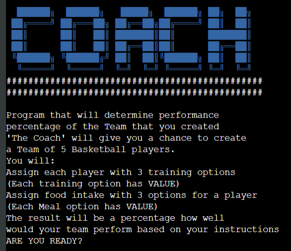
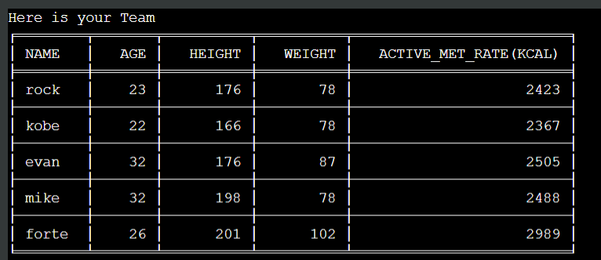
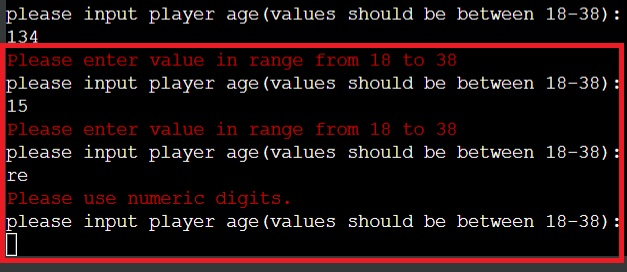

# THE COACH

(Developer: Roman Rakic)

[Live live website -->](https://romanscoach.herokuapp.com/)

## About

The Coach is a command-line small Python program that can be considered a type of simulation or game. Project will put user in a position of a Coach for
a team of 5 Basketball players that will be created based on user input. Input has to be inside Realistic parameters determined by the developer.Program will output the percentage of possible team performance so that user will have a Idea of how good final result Is.Program was developed as a 3rd portfolio project in acquiring the "Diploma In Software Development" with Code institute.
The requirements of this project were use of Python programming language and it's libraries to develop a program in a mock terminal in the browser. 

## Table of Contents
  - [Project Goals](#project-goals)
    - [User Goals](#user-goals)
    - [Site Owner Goals](#site-owner-goals)
  - [User Experience](#user-experience)
    - [Target Audience](#target-audience)
    - [User Requirements and Expectations](#user-requirements-and-expectations)
    - [User Manual](#user-manual)
  - [User Stories](#user-stories)
    - [Users](#users)
    - [Site Owner](#site-owner)
  - [Technical Design](#technical-design)
    - [Flowchart](#flowchart)
    - [Data Models](#data-models) 
  - [Technologies Used](#technologies-used)
    - [Languages](#languages)
    - [Frameworks & Tools](#frameworks--tools)
    - [Libraries](#libraries)
  - [Features](#features)
  - [Future-features](#future-features-to-implement)
  - [Validation](#validation)
  - [Testing](#testing)
    - [Manual Testing](#manual-testing)
    - [Automated Testing](#automated-testing)
  - [Bugs](#bugs)
  - [Deployment](#deployment)
  - [Credits](#credits)
  - [Acknowledgements](#acknowledgements)

## Project Goals

- The Coach program is intended to be the beginning of possible
real-world application used in sports by coaches, mentors and even
athletes themself.With certain upgrades and some more real-world based 
calculations in regard of caloric values and influences of certain training routines to athlete's bodies this program could provide value and assist
in optimizing the team and individual performance of an athlete.

### User Goals
- Interact with program that is fun and easy to understand
- Use a program that has real-life potential
- Be able to Log in and come back to the existing account
- Create something fun and unique 
- See the result of input choices

### Site Owner Goals

- Create a program that is Easy to use
- Create a program with possible real-world usage
- Create a program that provides feedback to a user
- Create a program that can be further developed in multiple directions

## User Experience

### Target Audience

- Sports enthusiasts
- Coahing enthusiasts
- Strategic thinkers

### User Requirements and Expectations

- Simple easy to use and understand program
- Intuitive navigation
- Engaging content
- Possibility of creativity inside certain parameters
- Personalization (usernames and player names)
- Feedback to user in different stages of programm
- Final result

### User Manual

Click here to view instructions

#### Overview
- Using this program user will create 5 players inside given parameters that allow certain creativity.In the next stage user will choose 3 different types of training ,each training got a value (that is not presented to a user, but user is warned that the higher the number of training that value is  higher)
that will Carry a half of the player overall value.next stage calls user to pick 3 food options for each player.also each option has a caloric value (not presented to a user ). so user has to use common sense for food options ,cause caloric value of the food will be compared to a user active metabolic rate that is calculated after input values for each player.Food options will carry another half of player value. final stage of program is giving feedback to user with final result got with calculating both halfs of user value and than getting overall value of team in percentage

#### Main Menu

- Main menu is presented to user with ASCII art of the program title
and short description of program instuctions.
at the bottom of menu user is presented with 2 options 
option to proceed and option to exit the program
input validation is implemented troughout program so if invalid or outside parameters input is given user will be prompted to repeat the input  

### exit
- program is terminated  

#### proceed

- this option will present user with 
another 2 options
1. new user 
2. existing user

#### New user registration (sign-up)

 - user is asked to create username and to put
 the email.
 - user email is validated with python (email_validator) library 
 - after both inputs are validated user credentials are stored into th database(google spreadsheet)

#### existing user

- this option will returnig user to input
email adress. if email is found in database program will retrieve users username and greet user with username and percentage(score) user had on his last use of the program

#### Program
 
- user will create 5 players and each player will consist of name,age,height and weight. all inputs will go trough 
validation process

Operation: Input numbers and characters then press enter key.

#### players data table

- after creating a team user is presented with table 
consisting of his inputs for each player and active metabolic rate value calculated based on inputs.

##### training

- user will have to assign 3 training options to each player and each option has certain value
 validation of inputs is implemented also.

Operation: Input a numeric value and press enter key.

#### meals

- user will assign 3 food options for each player, and 
also each option carries certain calorie value
input validation implemented.

Operation: Input a numeric value and press enter key.

#### final values table 

- after choosing training and meals for all players 
program will perform calculation and present to user table of values thad lead to final result.

#### team performance percentage

- final calculation is done and it's presented to user
with thank you message

#### end of program menu

- after final result user will be presented with 2 options menu
1. go again
2. exit

Operation: Input a numeric value and press enter key.

#### go again

- user is returned back to create team 
and his previous result is cleared from the database 

#### Exit program

[Back to Table Of Contents](#table-of-contents)

## User Stories

### Users

1. I want to have an idea what the program is about
2. I want to be able to have clear and simple navigation   
3. I want to be able log in and return to a program later
4. I want to be able to get feedback in different stages of program
5. I want to be informed why my input is not valid
6. I want input parameters to be displayed clearly
7. I want to see what choices i made
8. I want to be able to play multiple times without loging in again
9. I want to use the program with real-world data
10. I want to use the program that allows certain creativity inside parameters
11. I want to know the final result of using the program  

### Site Owner
 
12. I want user to easily and intuitevly navigates troughout program
13. I want user to be guided and informed how to make valid inputs
14. I want user to be able to personalize his experience and inputs
15. I want user to have clear feedback from  inputs
16. I want user details to be stored and retrieved on demand into the database
17. I want user to have option to exit the program
18. I want user to know the final result

[Back to Table Of Contents](#table-of-contents)

## Technical Design

### Flowchart

The following flowchart summarises the structure and logic of the application.

Flowchart

### Data models

- OOP(object oriented programming) was implemented in certain parts of this programm
- classes -- One class was used to create all players with certain attributes(name,age,weight,height),
and method that calculates active metabolic rate of each player.
- lists -- usage of lists in program is quite often because most of operations and calculations required repetition and iteration multiple times.
- google sheets API - used to manipulate data(CRUD- create ,read update and delete)
- Calorie ninjas API - used to retrieve caloric value from users input 

## Technologies Used

### Languages

- [Python](https://www.python.org/) programming language for the logic of the program

### Frameworks & Tools

-  was used to draw program flowchart

- [Git](https://git-scm.com/) was used for version control within VSCode to push the code to GitHub
- [GitHub](https://github.com/) was used as a remote repository to store project code
- [Google Cloud Platform](https://cloud.google.com/cloud-console/) was used to manage access and permissions to the Google Services such as Google auth, sheets etc.
- [Google Sheets](https://www.google.co.uk/sheets/about/) were used to store players details
- [Heroku Platform](https://dashboard.heroku.com/) was used to deploy the project into live environment
- [Font Awesome](https://fontawesome.com/) - icons from Font Awesome were used in the footer below the program terminal
- [Visual Studio Code (VSCode)](https://code.visualstudio.com/)
VSCode was used to write the project code using Code Institute template

### Libraries

#### Python Libraries
- click - used to clear the terminal 
- random - used to generate random palyer values inside given parameters
- typing -used for type hints and return data types in python code
- sys & sleep - used to create a typing effect troughout the project
- time - used to displayed delayed messages in the terminal
- [unittest](https://docs.python.org/3/library/unittest.html) - used to carry out testing on single units in validation.py file

#### Third Party Libraries
- [requests ](https://pypi.org/project/requests/)- used this library to call [CalorieNinjas API](https://calorieninjas.com/api) and get caloric values of assigned meals 
- -
- [colorama](https://pypi.org/project/colorama/) - used this library to add color to the terminal and enhance user experience.  warning information is marked red while details that user can focus on with green color.Program title was colored blue 
- [email_validator](https://pypi.org/project/email-validator/) - used this library to validate if user email input is in correct form
- [gspread](https://docs.gspread.org/en/latest/) - JUSTIFICATION: used gspread for data manipulation inside  Google spreadsheet and  interaction with Google APIs
- [google.oauth2.service_account](https://google-auth.readthedocs.io/en/master/) -  module used to set up the authentification needed to access the Google API and connect my Service Account with the Credentials function. A creds.json file is created with all details the API needs to access the google account. In deployment to heroku this information is stored in the config var section along with another custom config var provided by code institute.

[Back to Table Of Contents](#table-of-contents)

## Features

### Intro Screen

- Introduce user with a program and give a hint what is it about
- user story covered: 1

    
Intro screen Screenshot

  

### Program instructions

- Displaying instructions on how to use program and what to expect
- user story covered: 1

    
Screenshot

### Options menu 1

- provide 2 options for a user
to proceed or exit a program
- user story covered: 17,16,12,2

Screenshot

### Options menu 2

- User is presented with option to to (sign-up) as a new user or to (log-in)
as an existing user 
- user story covered: 3,16,12,2

Screenshot

### Create user(Sign-up)

- User is prompted to make a username
- validating username input
- user asked to provide valid email address
- informs user is email in valid format
- saving credentials into the Google Spreadsheet
- user story covered: 3,16,5,14

Screenshot

### Validate exsisting user(Log-in)

- User is prompted to enter the valid email that is stored in database
- validating email
- if email is not in database user is taken step back to choose
 between new user or existing user
 - if email is in database user is greeted with username
 and with last result achieved while using the program
- user story covered: 15,3,16

Screenshot

### Creating players

- user can start creating players inside
  given parameters
- if input is not inside parameter user is asked to repeat the input 
along with message that gives instruction on valid inputs
- user story covered: 6,9,13,14,10

Screenshot

### Created players table

- table with user input values for each created player
- user story covered: 4,15,7

Screenshot

### Trainings menu

- User can choose from range of training options and pick 3 for each player
input validation implemented
- user story covered: 9,7,2

Screenshot1

Screenshot2

### Trainings-choosed

- trainings for a player is displayed after choosing 3 options
- user story covered: 7,15

Screenshot

### Meals Menu

- User i presented with meal options for each player and have to assign 3 options for each player
- user story covered: 9,6,10,7

Screenshot

### Meals choosed

- meals for each player is displayed after every 3 meals choosen
- user story covered: 7,15

Screenshot

### Calculated values table

- Calculated value for each player ,values will be used to determine final result
- user story covered: 15,4,7

Screenshot

### Final value and thank you note

- user is presented with final result of the program
team performance percentage based on inputs given
and user is greeted with a thank you message
- user story covered: 11,18

Screenshot

### End or play again menu

- user has 2 options to choose to go again or to exit program
- if go again is chosen user final result achieved is deleted from the database and it will be updated with new result at the end
- is exit option is chosen program is terminated
- user story covered: 8,2,12

Screenshot

### User Input Validation
- Displays an error message if user input is not in a form that was expected or 
inside given parameters
- Asks for a new input and provides guidance to user on how to make valid input
- User stories covered: 5,6,13,15

    
Username validation Screenshot

    
Email validation Screenshot

    
Validation of in-program inputs  Screenshot

Player-validation1 Screenshot

Player-validation2 Screenshot

Player-validation3 Screenshot

 

Training-validation Screenshot

Meals-validation Screenshot

[Back to Table Of Contents](#table-of-contents)

## Future features to implement

- Future development of this program would very likely include
1. Training options for longer period of time(week)
2. Diet schedule period of (week or more)
3. Rest schedule period of(week or more)
4. Implementing calculation of training impact to individual athlete and adding that calculation to 
final percentage

## Validation

- Since  [PEP8 Validation Service](http://pep8online.com/) site is down and can't be used
PEP8 validator "pycodestyle" was installed directly to  Gitpod Workspace and Im uploading images of all 
python files in my project. All files are cleared of errors and are up to PEP8 standards (if there were any errors there would be a red line inside my source code)

run.py

player.py

data.py

validate.py

colors.py

## Testing

The testing approach is as follows:
1. Manual testing of user stories
2. Automated unit testing using the Python unittest library

### Manual Testing

 User stories testing

1. I want to have an idea what the program is about

| **Feature**   | **Action**                    | **Expected Result**          | **Actual Result** |
| ------------- | ----------------------------- | ---------------------------- | ----------------- |
| Intro screen | User is presented with an intro text | Intro screen presented | Works as expected |
| Program instructions |User is presented with  Program instructions screen | instructions screen presented| Works as expected | 

Screenshot

Screenshot

2. I want to be able to have clear and simple navigation

| **Feature**   | **Action**                    | **Expected Result**          | **Actual Result** |
| ------------- | ----------------------------- | ---------------------------- | ----------------- |
| Options menu 1 | Select between 2 options | user is taken to options menu 2 (where new or existing user option is presented ) or user is exiting the program  | Works as expected |
| Options menu 2 |  Select between 2 options | use can create a new user or log in as an existing one | Works as expected|
| End or play again menu | Select between 2 options | user can go agin and go trough program or exit the program| Works as expected|

Screenshot

Screenshot

Screenshot

3. I want to be able log in and return to a program later

| **Feature**   | **Action**                    | **Expected Result**          | **Actual Result** |
| ------------- | ----------------------------- | ---------------------------- | ----------------- |
| Create user(Sign-up)| User is choosing new user option| User is prompted to put a username and valid email address| Works as expected |
| Validate exsisting user(Log-in) |User is choosing existing  user option | User is prompted valid email address if email is in database user is greeted with username and can proceed to using program| Works as expected|

Screenshot

Screenshot

4. I want to be able to get feedback in different stages of program

| **Feature**   | **Action**                    | **Expected Result**          | **Actual Result** |
| ------------- | ----------------------------- | ---------------------------- | ----------------- |
| Created players table | expected from user to put in valid inputs | Table with input values is presented| Works as expected| 
| Calculated values table | user inputs  expected to be valid | Table with Calculated values is presented |  Works as expected| 

Screenshot

Screenshot

5. I want to be informed why my input is not valid 

| **Feature**   | **Action**                    | **Expected Result**          | **Actual Result** |
| ------------- | ----------------------------- | ---------------------------- | ----------------- |
| user input validations| user input is otutside parameters or invalid| Red text displayed informing user on invalid input| Works as expected| 

Screenshot1

Screenshot2

Screenshot3

6. I want input parameters to be displayed clearly

| **Feature**   | **Action**                    | **Expected Result**          | **Actual Result** |
| ------------- | ----------------------------- | ---------------------------- | ----------------- |
| Creating players | parameters for input displayed| user inputs valid input |Works as expected| 
| Meals Menu |  parameters for input displayed |user inputs valid input |Works as expected| 

Screenshot

Screenshot

7. I want to see what choices i made

| **Feature**   | **Action**                    | **Expected Result**          | **Actual Result** |
| ------------- | ----------------------------- | ---------------------------- | ----------------- |
| Created players table | user inputs are valid | table is presented to user | Works as expected| 
| Trainings-choosed|  user inputs are valid | training choices are displayed | Works as expected| 
| Meals-choosed |  user inputs are valid | meal choices are displayed | Works as expected|

Screenshot

Screenshot

Screenshot

8. I want to be able to play multiple times without loging in again 

| **Feature**   | **Action**                    | **Expected Result**          | **Actual Result** |
| ------------- | ----------------------------- | ---------------------------- | ----------------- |
| End or play again menu | All input values are valid | End game menu presented | Works as expected|

Screenshots

9. I want to use the program with real-world data 

| **Feature**   | **Action**                    | **Expected Result**          | **Actual Result** |
| ------------- | ----------------------------- | ---------------------------- | ----------------- |
| Creating players |user credentials are validated| real-world parameters presented to user | Works as expected|
| Trainings menu | user successfully created players | real-world parameters presented to user | Works as expected|
| Meals Menu | user assigned trainings to players |real-world parameters presented to user | Works as expected|

Screenshots

Screenshots

Screenshots

10. I want to use the program that allows certain creativity inside parameters

| **Feature**   | **Action**                    | **Expected Result**          | **Actual Result** |
| ------------- | ----------------------------- | ---------------------------- | ----------------- |
| Creating players | user credentials are validated| various inputs inside parameters gives creativity to user |Works as expected|

Screenshots

11. I want to know the final result of using the program 

| **Feature**   | **Action**                    | **Expected Result**          | **Actual Result** |
| ------------- | ----------------------------- | ---------------------------- | ----------------- |
|Final value and thank you note| all previous inputs were valid | user presented with final team performance value | Works as expected|

Screenshots

12. I want user to easily and intuitevly navigates troughout program 

| **Feature**   | **Action**                    | **Expected Result**          | **Actual Result** |
| ------------- | ----------------------------- | ---------------------------- | ----------------- |
| Options menu 2 | user can choose between 2 options| user taken to desired direction depending on input |Works as expected|
| End or play again menu | user can choose between 2 options| user taken to desired direction depending on input |Works as expected|

Screenshot

Screenshot

13. I want user to be guided and informed how to make valid inputs 

| **Feature**   | **Action**                    | **Expected Result**          | **Actual Result** |
| ------------- | ----------------------------- | ---------------------------- | ----------------- |
| User Input Validation | user input is otutside parameters or invalid| Red text displayed informing user on invalid input| Works as expected|   

Screenshot1

Screenshot2

Screenshot3

14. I want user to be able to personalize his experience and inputs

| **Feature**   | **Action**                    | **Expected Result**          | **Actual Result** |
| ------------- | ----------------------------- | ---------------------------- | ----------------- |
| Creating players | user input can be anything inside given parameters| personalized valid input and experience| Works as expected| 
| Create user(Sign-up) |  user input can be anything inside given parameters| personalized valid input and experience| Works as expected|

Screenshots

Screenshots

15. I want user to have clear feedback of inputs

| **Feature**   | **Action**                    | **Expected Result**          | **Actual Result** |
| ------------- | ----------------------------- | ---------------------------- | ----------------- |
| Training choosed | valid training inputs | trainings choosed presented to user|Works as expected|
| Meals choosed | valid meal inputs| meals choosed presented to user|Works as expected|
| Created players table | valid inputs when creating players | table with player values presented |Works as expected|

Screenshots

Screenshots

Screenshots

16. I want user details to be stored and retrieved on demand into the database

| **Feature**   | **Action**                    | **Expected Result**          | **Actual Result** |
| ------------- | ----------------------------- | ---------------------------- | ----------------- |
| Create user(Sign-up) | input valid credentials for user | user credentials stored in database | Works as expected|
| Validate exsisting user(Log-in) | input valid email | email is retrieved from database and user is greeted | Works as expected|

Screenshots

Screenshots

17. I want user to have option to exit the program

| **Feature**   | **Action**                    | **Expected Result**          | **Actual Result** |
| ------------- | ----------------------------- | ---------------------------- | ----------------- |
| Options menu 1 | user can choose option to exit program | program is terminated | Works as expected|
| End or play again menu | user can choose option to exit program | program is terminated | Works as expected|

Screenshots

Screenshots

18. I want user to know the final result

| **Feature**   | **Action**                    | **Expected Result**          | **Actual Result** |
| ------------- | ----------------------------- | ---------------------------- | ----------------- |
| Final value and thank you note | after all inputs are valid and inside given parameters | final result presented |Works as expected|

Screenshots

### Automated Testing

See unit testing

- I wrote unit tests using Python unittest library
- I tested separate functions to verify correct user input:
  - validation of user email and user name input

I needed to amend the function and add 'Try Except' blocks to handle TypeError.
Initial error called - 'TypeError: object of type 'int' has no len()'

[Back to Table Of Contents](#table-of-contents)
## Bugs

| **Bug** | **Fix** |
| ------- | ------- |
| In validating user inputs when creating player pycodestyle was warning about "too broad exception" in while loop.| add  "ValueError" whan catching the exception with suitable error message|
| When breaking a too long line of code forgot to put (\) to move on next line and didnt match previous indentation| putting (\) when moving on next line and press (tab)
to match previous line indentation|
|when using Colorama and keyword "Fore" to color the  choices that requires user input ,user input was in last color of choice(red)|I colored the blank space white before closing colored choices line so anything inputed after that would be in white color|
|When creating subclass palyer in a for loop and keyword range i set the wrong range cause last number in range is not included|change last number in range to one greater 

## Deployment

### Heroku
Application has been deployed from GitHub to Heroku by following the steps:

1. Create or log in to your account at heroku.com
2. Create a new app, add a unique app name ( for example PP3_The_Coach) and then choose your region
3. Click on create app
4. Go to "Settings"
5. Under Config Vars store any sensitive data you saved in .json file. Name 'Key' field, copy the .json file and paste it to 'Value' field. Also add a key 'PORT' and value '8000'.
6. Add required buildpacks (further dependencies). For this project, set it up so Python will be on top and Node.js on bottom
7. Go to "Deploy" and select "GitHub" in "Deployment method"
8.To connect Heroku app to your Github repository code enter your repository name, click 'Search' and then 'Connect' when it shows below
9.  Choose the branch you want to buid your app from
10. If prefered, click on "Enable Automatic Deploys", which keeps the app up to date with your GitHub repository
11. Wait for the app to build. Once ready you will see the “App was successfully deployed” message and a 'View' button to take you to your deployed link.

### Forking the GitHub Repository
1. Go to the GitHub repository
2. Click on Fork button in top right corner
3. Copy of the repository will be in your own GitHub account.
   
### Making a Local Clone
1. Go to the GitHub repository 
2. Locate the Code button above the list of files (next to 'Add file') and click it
3. Highlight the "HTTPS" button to clone with HTTPS and copy the link
4. Open Git Bash
5. Change the current working directory to the one where you want the cloned directory
6. Type git clone and paste the URL from the clipboard ($ git clone https://github.com/YOUR-USERNAME/YOUR-REPOSITORY)
7. Press Enter to create your local clone

[Back to Table Of Contents](#table-of-contents)

## Credits

### Code
-  [gspread documentation](https://docs.gspread.org/en/latest/user-guide.html) explained how to create read update and delete  values in the google spreadsheet
- [CalorieNinjas-API-Documentation](https://calorieninjas.com/api) - helped me in making function that calculates caloric value of user choices for each player.
- [ASCII Art Generator](http://patorjk.com/software/taag/) was used to create game title

- Code Institute -  "Love Sandwiches - Essentials Project" walktrough  helped me to connect  Google Spreadsheet to my project.

- How to install a Python module, eg. [email validation](https://pypi.org/project/email-validator/Installing)

- How to add colored text to Python terminal [colorama(0.4.5)](https://pypi.org/project/colorama/)
 
- [code](https://click.palletsprojects.com/en/8.0.x/utils/) used to clear the terminal console

## Acknowledgements

***
I would like to take a few moments to say Thank you to following people:

- First i would like to thank my wife Una and my daughter Tara for continuous support and understanding while working on development of this project.

-  I would like to thank my Mentor Mo.Shami for his support ,insight expertise and guidance.
- [Warwick Hart](https://github.com/BobWritesCode) for some great ideas and feedback when reviewing project.
-  Awesome Code Institute Slack community for being there
